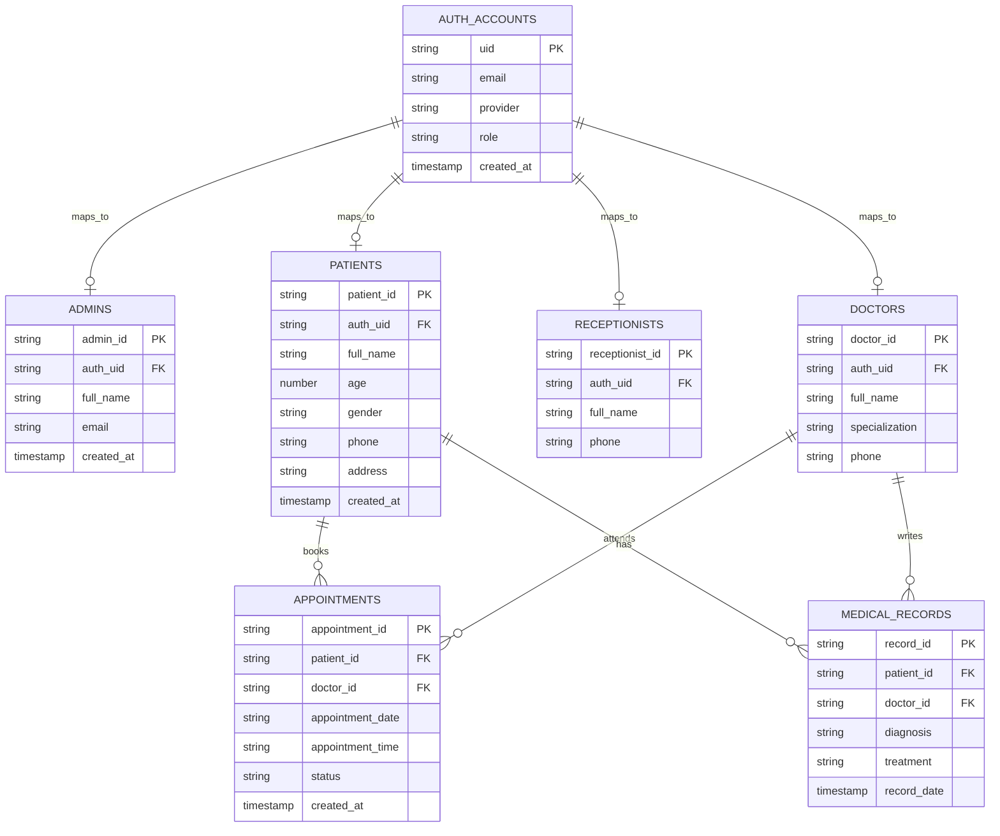

# **ENTITY RELATIONSHIP DIAGRAM (ERD)**

## **Patient Management System - Hospital Management & Patient Care Platform**

---

# **1. INTRODUCTION**

## **1.1 Purpose**

This document defines the Entity Relationship Diagram for the Patient Management System. It shows the major data entities, their attributes, and the relationships between them.

## **1.2 Scope**

The ERD covers the core system and extended modules required for:

* user management through Firebase Authentication
* patient registration and management
* appointment scheduling
* medical record tracking
* system reporting and operations

This ERD represents the logical data model that will be stored in **Cloud Firestore** and linked to **Firebase Authentication** accounts.

---

# **2. CORE ENTITIES**

The main entities in the system are:

* AuthAccount
* Admin
* Doctor
* Receptionist
* Patient
* Appointment
* MedicalRecord

---

# **3. ENTITY DEFINITIONS**

---

## **3.1 AuthAccount**

Represents the authenticated account managed by Firebase Authentication.

**Key Attributes:**

* uid
* email
* provider
* role
* created_at

---

## **3.2 Admin**

Represents a system administrator profile stored in Firestore.

**Key Attributes:**

* admin_id
* auth_uid
* full_name
* email
* created_at

---

## **3.3 Doctor**

Represents a doctor in the hospital.

**Key Attributes:**

* doctor_id
* auth_uid
* full_name
* specialization
* phone

---

## **3.4 Receptionist**

Represents front desk staff responsible for patient registration and appointments.

**Key Attributes:**

* receptionist_id
* auth_uid
* full_name
* phone

---

## **3.5 Patient**

Represents a registered patient in the hospital system.

**Key Attributes:**

* patient_id
* auth_uid
* full_name
* age
* gender
* phone
* address
* created_at

---

## **3.6 Appointment**

Represents a scheduled meeting between a patient and a doctor.

**Key Attributes:**

* appointment_id
* patient_id
* doctor_id
* appointment_date
* appointment_time
* status
* created_at

---

## **3.7 MedicalRecord**

Represents the diagnosis and treatment information of a patient.

**Key Attributes:**

* record_id
* patient_id
* doctor_id
* diagnosis
* treatment
* record_date

---

# **4. RELATIONSHIPS**

---

## **4.1 AuthAccount -> Admin**

One authenticated account can map to one admin profile.

**Relationship:** AuthAccount 1 : 0..1 Admin

---

## **4.2 AuthAccount -> Doctor**

One authenticated account can map to one doctor profile.

**Relationship:** AuthAccount 1 : 0..1 Doctor

---

## **4.3 AuthAccount -> Receptionist**

One authenticated account can map to one receptionist profile.

**Relationship:** AuthAccount 1 : 0..1 Receptionist

---

## **4.4 AuthAccount -> Patient**

One authenticated account can optionally map to one patient profile.

**Relationship:** AuthAccount 1 : 0..1 Patient

---

## **4.5 Patient -> Appointment**

One patient can have many appointments.
Each appointment belongs to one patient.

**Relationship:** Patient 1 : M Appointment

---

## **4.6 Doctor -> Appointment**

One doctor can have many appointments.
Each appointment belongs to one doctor.

**Relationship:** Doctor 1 : M Appointment

---

## **4.7 Patient -> MedicalRecord**

One patient can have many medical records.
Each record belongs to one patient.

**Relationship:** Patient 1 : M MedicalRecord

---

## **4.8 Doctor -> MedicalRecord**

One doctor can create many medical records.
Each record is created by one doctor.

**Relationship:** Doctor 1 : M MedicalRecord

---

# **5. TEXTUAL ER DIAGRAM**

AuthAccount
-> 0..1 Admin
-> 0..1 Doctor
-> 0..1 Receptionist
-> 0..1 Patient

Patient
-> Appointment
-> MedicalRecord

Doctor
-> Appointment
-> MedicalRecord

Appointment
(links Patient and Doctor)

MedicalRecord
(links Patient and Doctor)

---

# **6. MERMAID ER DIAGRAM (TEXT REPRESENTATION)**

---

# **7. DESIGN NOTES**

* **Patient is a central entity** for hospital operations
* **Appointment connects Patient and Doctor**
* **MedicalRecord stores clinical data** and links both Patient and Doctor
* **AuthAccount controls authentication and user identity**
* Credentials are managed by Firebase Authentication, while profiles are stored in Firestore
* The system is designed for scalability so future modules like billing and laboratory can be added later
