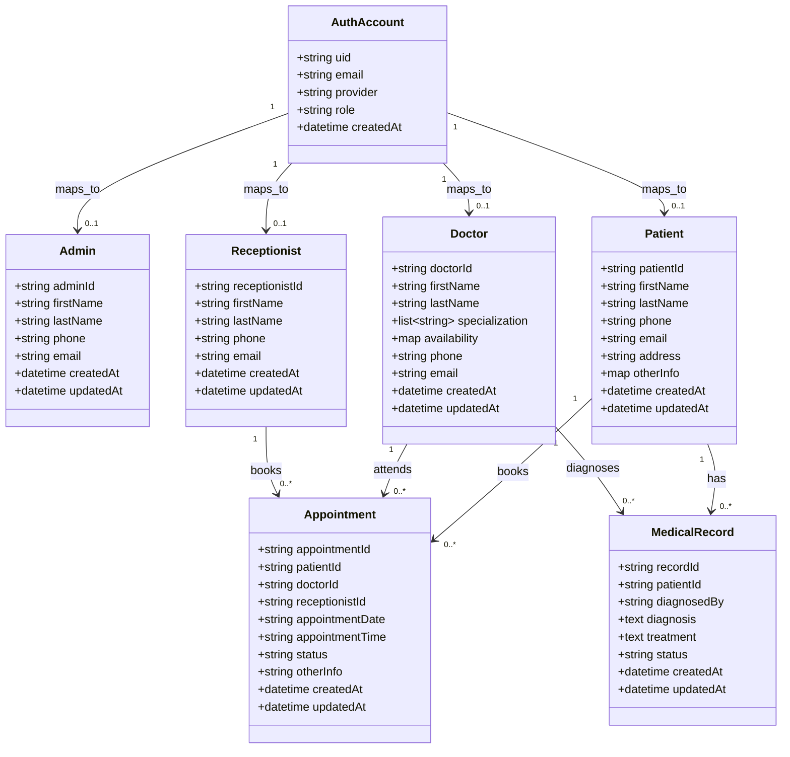
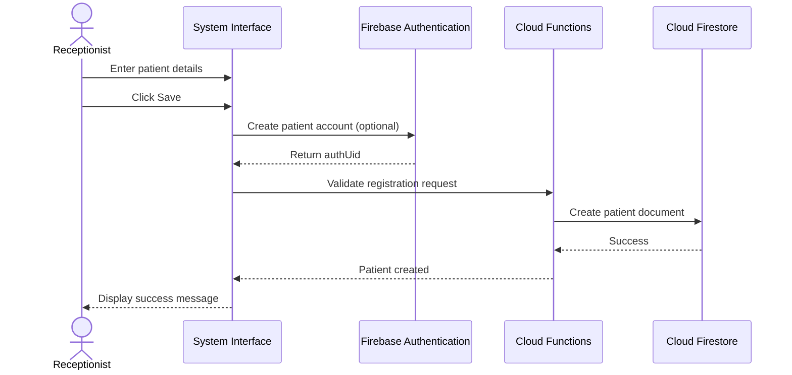
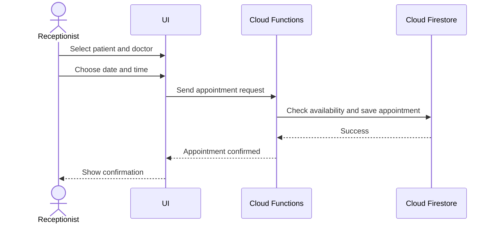
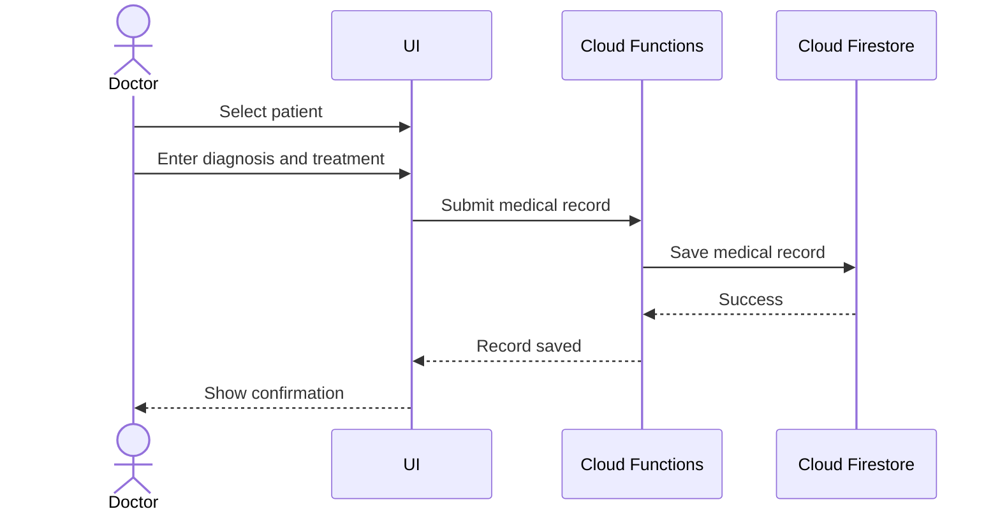
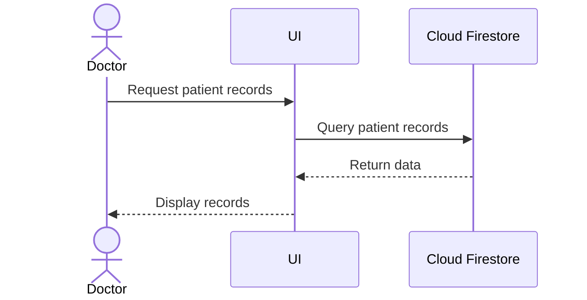
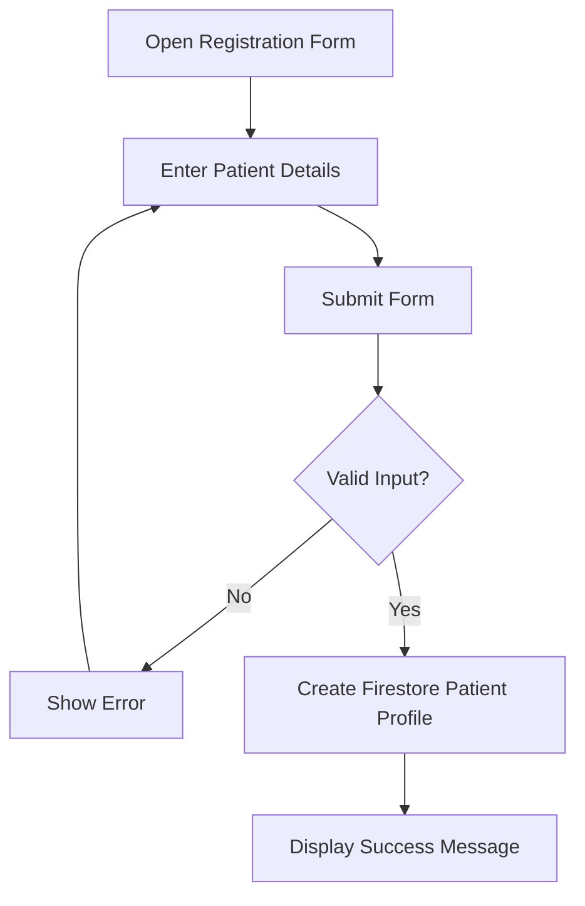
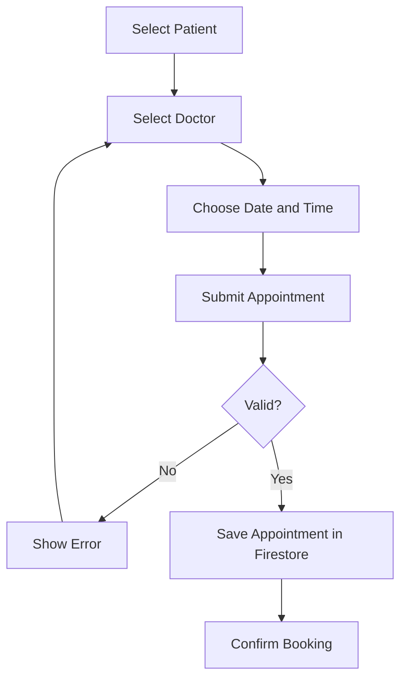
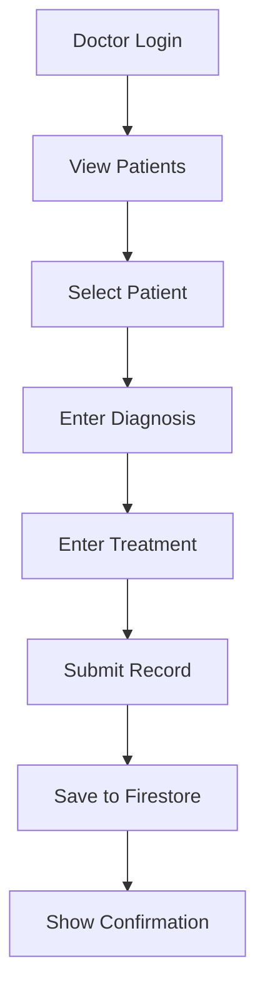
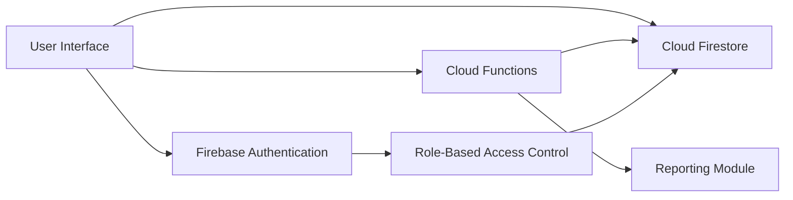

# **UML DIAGRAM DOCUMENT**

## **Patient Management System - Hospital Management & Patient Care Platform**

---

# **1. INTRODUCTION**

## **1.1 Purpose**

This document defines the key UML diagrams for the Patient Management System. It models the system behavior, structure, and interactions based on the approved requirements, Firebase-based system architecture, Firestore schema, and UI flow.

## **1.2 Scope**

The UML coverage includes:

* Use Case Diagram
* Class Diagram
* Sequence Diagrams
* Activity Diagrams
* Component Diagram

These diagrams focus on the core and extended system scope:

* hospital management system (desktop/web)
* Firebase service operations
* patient management
* appointment scheduling
* medical records handling

---

# **2. USE CASE DIAGRAM**

## **2.1 Purpose**

Shows the main interactions between users and the system.

## **2.2 Actors**

* Admin
* Doctor
* Receptionist
* Patient

## **2.3 Main Use Cases**

* Login
* Register Patient
* Manage Users (Admin)
* Schedule Appointment
* View Appointments
* Update Appointment
* Add Medical Record
* View Medical Record
* Manage Patients
* Generate Reports

## **2.4 Textual Use Case Representation**

Admin

* Login
* Manage Doctors
* Manage Receptionists
* Manage Patients
* Monitor System Activity
* View Reports

Receptionist

* Register Patient
* Schedule Appointment
* View Pending, Approved, and Declined Appointments
* Update Patient Information

Doctor

* View Appointments
* Schedule Approved Appointments
* Approve or Decline Appointment Requests
* View Patient Records
* Add Diagnosis
* Prescribe Treatment
* Update Own Medical Records
* Update Availability

Patient

* Book Appointments
* View Appointments
* View Medical Records

---

# **3. CLASS DIAGRAM**

## **3.1 Purpose**

Shows the main system entities and their relationships.

## **3.2 Core Classes**

* AuthAccount
* Admin
* Doctor
* Receptionist
* Patient
* Appointment
* MedicalRecord

## **3.3 Class Diagram (Text Representation)**

---

# **4. SEQUENCE DIAGRAMS**

---

## **4.1 Patient Registration**

### **Purpose**

Shows how a patient is registered into the system.

---

## **4.2 Appointment Scheduling**

### **Purpose**

Shows how an appointment is created.

---

## **4.3 Doctor Adds Medical Record**

### **Purpose**

Shows how a doctor records diagnosis and treatment.

---

## **4.4 View Patient Records**

### **Purpose**

Shows how records are retrieved.

---

# **5. ACTIVITY DIAGRAMS**

---

## **5.1 Patient Registration Activity**

---

## **5.2 Appointment Scheduling Activity**

---

## **5.3 Medical Record Entry Activity**

---

# **6. COMPONENT DIAGRAM**

## **6.1 Purpose**

Shows the main technical building blocks and their connections.

---

# **7. STATE TRANSITION NOTES**

## **7.1 Appointment State**

Appointments move through these states:

* Pending -> Approved
* Pending -> Declined
* Approved -> Completed

---

## **7.2 User Session State**

* Logged Out -> Login -> Authenticated -> Role Loaded -> Logged In -> Logout

---

# **8. UML DESIGN NOTES**

* **Patient is the central entity** in the system
* **Appointment connects patient and doctor**
* **MedicalRecord stores clinical data**
* **AuthAccount controls authentication and user identity**
* Firestore stores structured application data
* Cloud Functions handle backend validation and workflow processing
* The system is designed to support future modules like billing and laboratory
